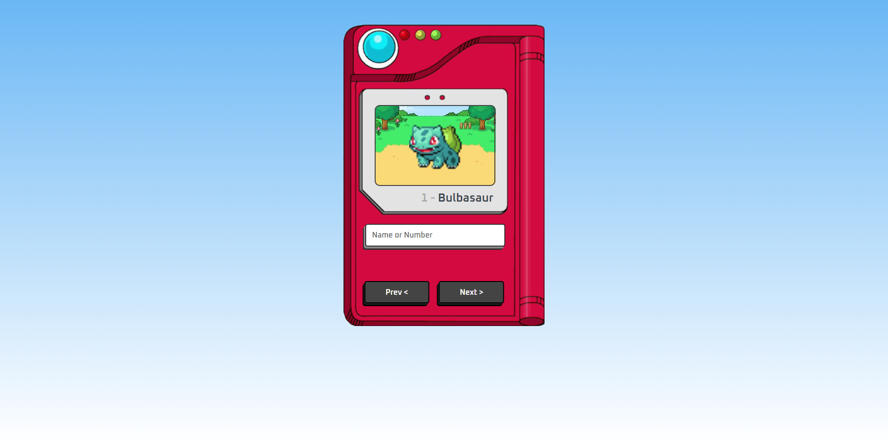

# 
 Pokedéx 

                             </a>

Pokedéx que consome a API do PokeAPI

## 🛠️ Technologies

<ul>
  <li><a href="https://www.javascript.com/">JavaScript/a></li>
  <li><a href="https://www.w3schools.com/css/">CSS</a></li>
</ul>

